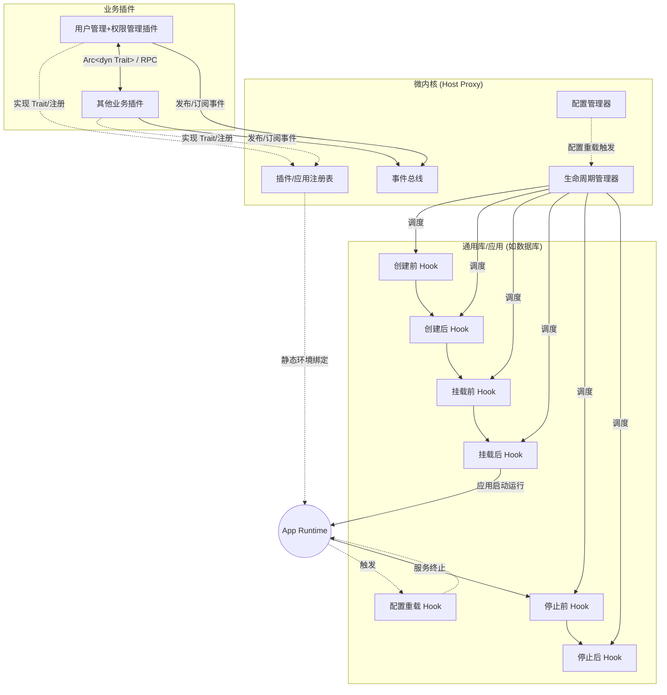

# 架构概览图 (System Graph)

本文档使用 Mermaid 绘制了微内核、应用生命周期和插件之间依赖关系的系统全景图。
AI Agent 和开发者可以直观地通过本图理解各组件间的相互作用。

## 微内核与应用/插件架构图

```mermaid
graph TD
    subgraph Microkernel["微内核 (Host Proxy)"]
        KernelConfig["配置管理器"]
        LifecycleManager["生命周期管理器"]
        PluginRegistry["插件/应用注册表"]
        EventBus["事件总线"]
    end

    subgraph GenericApps["通用库/应用 (如数据库)"]
        PreCreate["创建前 Hook"]
        PostCreate["创建后 Hook"]
        PreMount["挂载前 Hook"]
        PostMount["挂载后 Hook"]
        Reload["配置重载 Hook"]
        PreStop["停止前 Hook"]
        PostStop["停止后 Hook"]
    end

    subgraph Plugins["业务插件"]
        UserAuth["用户管理+权限管理插件"]
        OtherPlugin["其他业务插件"]
    end

    %% 内核功能交互
    KernelConfig -.->|配置重载触发| LifecycleManager
    LifecycleManager -->|调度| PreCreate
    LifecycleManager -->|调度| PostCreate
    LifecycleManager -->|调度| PreMount
    LifecycleManager -->|调度| PostMount
    LifecycleManager -->|调度| PreStop
    LifecycleManager -->|调度| PostStop

    %% 应用挂载
    PreCreate --> PostCreate --> PreMount --> PostMount
    PostMount -->|应用启动运行| AppRuntime((App Runtime))
    AppRuntime -.->|触发| Reload
    Reload -.-> AppRuntime
    AppRuntime -->|服务终止| PreStop --> PostStop

    %% 插件注册
    UserAuth -.->|实现 Trait/注册| PluginRegistry
    OtherPlugin -.->|实现 Trait/注册| PluginRegistry
    PluginRegistry -.->|静态环境绑定| AppRuntime

    %% 跨插件通信
    UserAuth <-->|Arc&lt;dyn Trait&gt; / RPC| OtherPlugin
    UserAuth -->|发布/订阅事件| EventBus
    OtherPlugin -->|发布/订阅事件| EventBus
```
